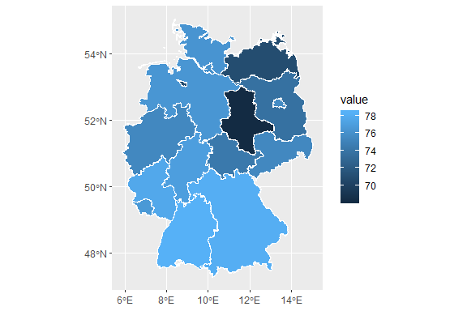
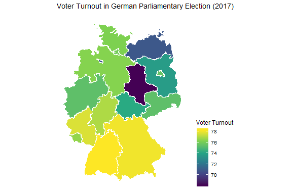

<!-- README.md is generated from README.Rmd. Please edit that file -->

# datenguideR 

<!-- badges: start -->

[](https://travis-ci.org/CorrelAid/datenguideR)
[](https://cran.r-project.org/package=datenguideR)
[](https://codecov.io/gh/CorrelAid/datenguideR?branch=master)
<!-- badges: end -->

Access and download German regional statistics from Datenguide
<http://datengui.de>. `datenguideR` provides a wrapper for their GraphQL
API and also includes metadata for all available statistics and regions.

**Overview**

  - [Usage](https://github.com/CorrelAid/datenguideR#usage)
  - [Examples](https://github.com/CorrelAid/datenguideR#examples)
      - [Search meta data
        (`dg_search`)](https://github.com/CorrelAid/datenguideR#dg_search)
      - [Main function
        (`dg_call`)](https://github.com/CorrelAid/datenguideR#dg_call)
      - [Multiple regions (at
        once)](https://github.com/CorrelAid/datenguideR#multiple-regions-with-nuts_nr-or-lau_nr)
      - [Plot data on maps
        (`dg_map`)](https://github.com/CorrelAid/datenguideR#dg_map)
  - [Use Cases](https://github.com/CorrelAid/datenguideR#use-cases)
  - [Credits and
    Acknowledgements](https://github.com/CorrelAid/datenguideR#credits-and-acknowledgements)
  - [Code of
    Conduct](https://github.com/CorrelAid/datenguideR#code-of-conduct)

## Usage

First, install datenguideR from GitHub:

``` r
devtools::install_github("CorrelAid/datenguideR")
```

Load package:

``` r
library(datenguideR)
```

## Examples

Get IDs of all available NUTS-1 regions:

``` r
datenguideR::dg_regions %>%
  dplyr::filter(level == "nuts1") %>%
  knitr::kable()
```

| id | name                   | level | parent |
| :- | :--------------------- | :---- | :----- |
| 01 | Schleswig-Holstein     | nuts1 | DG     |
| 02 | Hamburg                | nuts1 | DG     |
| 03 | Niedersachsen          | nuts1 | DG     |
| 04 | Bremen                 | nuts1 | DG     |
| 05 | Nordrhein-Westfalen    | nuts1 | DG     |
| 06 | Hessen                 | nuts1 | DG     |
| 07 | Rheinland-Pfalz        | nuts1 | DG     |
| 08 | Baden-Württemberg      | nuts1 | DG     |
| 09 | Bayern                 | nuts1 | DG     |
| 10 | Saarland               | nuts1 | DG     |
| 11 | Berlin                 | nuts1 | DG     |
| 12 | Brandenburg            | nuts1 | DG     |
| 13 | Mecklenburg-Vorpommern | nuts1 | DG     |
| 14 | Sachsen                | nuts1 | DG     |
| 15 | Sachsen-Anhalt         | nuts1 | DG     |
| 16 | Thüringen              | nuts1 | DG     |

Get all available meta data on statistics, substatistics, and
parameters:

``` r
datenguideR::dg_descriptions
#> # A tibble: 3,419 x 11
#>    stat_name stat_description stat_descriptio… substat_name
#>    <chr>     <chr>            <chr>            <chr>       
#>  1 AENW01    Entsorgte/behan… "**Entsorgte/be… <NA>        
#>  2 AENW02    Abgelagerte Abf… "**Abgelagerte … <NA>        
#>  3 AENW03    Entsorg.u.Behan… "**Entsorg.u.Be… <NA>        
#>  4 AENW04    Entsorgte/behan… "**Entsorgte/be… <NA>        
#>  5 AENW05    Abgelagerte Abf… "**Abgelagerte … <NA>        
#>  6 AENW06    Entsorg.u.Behan… "**Entsorg.u.Be… <NA>        
#>  7 AEW001    Entsorgungs- un… "**Entsorgungs-… <NA>        
#>  8 AEW001    Entsorgungs- un… "**Entsorgungs-… EBANL1      
#>  9 AEW001    Entsorgungs- un… "**Entsorgungs-… EBANL1      
#> 10 AEW001    Entsorgungs- un… "**Entsorgungs-… EBANL1      
#> # … with 3,409 more rows, and 7 more variables: substat_description <chr>,
#> #   param_name <chr>, param_description <chr>, stat_description_en <chr>,
#> #   stat_description_full_en <chr>, substat_description_en <chr>,
#> #   param_description_en <chr>
```

### `dg_search`

You can also use `dg_search` to look for a variable of interest. The
function will match your string with any strings in the
`dg_descriptions` data frame, returning only rows with those matches.

Looking for variables where the string *“vote”* appears somewhere in the
documentation:

``` r
dg_search("vote")
#> # A tibble: 90 x 11
#>    stat_name stat_description stat_descriptio… substat_name
#>    <chr>     <chr>            <chr>            <chr>       
#>  1 AI0501    Zweitstimmenant… "**Zweitstimmen… <NA>        
#>  2 AI0502    Zweitstimmenant… "**Zweitstimmen… <NA>        
#>  3 AI0503    Zweitstimmenant… "**Zweitstimmen… <NA>        
#>  4 AI0504    Zweitstimmenant… "**Zweitstimmen… <NA>        
#>  5 AI0505    Zweitstimmenant… "**Zweitstimmen… <NA>        
#>  6 AI0506    Wahlbeteiligung… "**Wahlbeteilig… <NA>        
#>  7 AI0601    Stimmenanteil C… "**Stimmenantei… <NA>        
#>  8 AI0602    Stimmenanteil S… "**Stimmenantei… <NA>        
#>  9 AI0603    Stimmenanteil F… "**Stimmenantei… <NA>        
#> 10 AI0604    Stimmenanteil G… "**Stimmenantei… <NA>        
#> # … with 80 more rows, and 7 more variables: substat_description <chr>,
#> #   param_name <chr>, param_description <chr>, stat_description_en <chr>,
#> #   stat_description_full_en <chr>, substat_description_en <chr>,
#> #   param_description_en <chr>
```

Note: Descriptions of variables are also available in English now\!
Translated via the
[`googleLanguageR`](https://github.com/ropensci/googleLanguageR)
package.

``` r
dg_search("vote") %>% 
  dplyr::select(stat_name, dplyr::contains("_en"))
#> # A tibble: 90 x 5
#>    stat_name stat_descriptio… stat_descriptio… substat_descrip…
#>    <chr>     <chr>            <chr>            <chr>           
#>  1 AI0501    Second Vote Sha… "** CDU / CSU s… <NA>            
#>  2 AI0502    SPD Second Vote… "** SPD second … <NA>            
#>  3 AI0503    FDP Second Vote… "** Second vote… <NA>            
#>  4 AI0504    Second Vote Sha… "** GREEN secon… <NA>            
#>  5 AI0505    Second Vote Sha… "** Second vote… <NA>            
#>  6 AI0506    Voter Turnout, … "** Voter turno… <NA>            
#>  7 AI0601    CDU / CSU, Euro… "** CDU / CSU v… <NA>            
#>  8 AI0602    SPD Vote Share,… "** SPD vote sh… <NA>            
#>  9 AI0603    FDP Share of Vo… "** FDP vote sh… <NA>            
#> 10 AI0604    Share of Votes … "** GREEN share… <NA>            
#> # … with 80 more rows, and 1 more variable: param_description_en <chr>
```

### `dg_call`

The main function of the package is `dg_call`. It gives access to all
API endpoints.

Simply pick a statistic and put it into `dg_call()` (infos can be
retrieved from `dg_descriptions`).

For example:

  - `stat_name`: AI0506 *(Wahlbeteiligung, Bundestagswahl)*
  - `region_id`: 11 (stands for Berlin)

<!-- end list -->

``` r
dg_call(region_id = "11",
        year = 2017,
        stat_name = "AI0506")
#> There may be a problem with the data (all values are equal).
#> # A tibble: 1 x 9
#>   id    name   year value GENESIS_source GENESIS_source_… stat_name
#>   <chr> <chr> <int> <dbl> <chr>          <chr>            <chr>    
#> 1 11    Berl…  2017  75.6 Regionalatlas… 99910            AI0506   
#> # … with 2 more variables: stat_description <chr>,
#> #   stat_description_en <chr>
```

A slightly more complex call with substatistics:

  - `stat_name`: BETR08 *(Landwirtschaftliche Betriebe mit Tierhaltung)*
  - `substat_name`: TIERA8 *(Landwirtschaftliche Betriebe mit
    Viehhaltung)*
  - `parameter`:
      - TIERART2 *(Rinder)*
      - TIERART3 *(Schweine)*

<!-- end list -->

``` r

dg_call(region_id = "11", 
        year = c(2001, 2003, 2007), 
        stat_name = "BETR08", 
        substat_name = "TIERA8", 
        parameter = c("TIERART2", "TIERART3")) 
#> # A tibble: 6 x 15
#>   id    name   year TIERA8 value GENESIS_source GENESIS_source_… stat_name
#>   <chr> <chr> <int> <chr>  <int> <chr>          <chr>            <chr>    
#> 1 11    Berl…  2001 TIERA…     8 Allgemeine Ag… 41120            BETR08   
#> 2 11    Berl…  2001 TIERA…     7 Allgemeine Ag… 41120            BETR08   
#> 3 11    Berl…  2003 TIERA…     9 Allgemeine Ag… 41120            BETR08   
#> 4 11    Berl…  2003 TIERA…     7 Allgemeine Ag… 41120            BETR08   
#> 5 11    Berl…  2007 TIERA…    11 Allgemeine Ag… 41120            BETR08   
#> 6 11    Berl…  2007 TIERA…     5 Allgemeine Ag… 41120            BETR08   
#> # … with 7 more variables: stat_description <chr>, substat_name <chr>,
#> #   substat_description <chr>, param_description <chr>,
#> #   stat_description_en <chr>, substat_description_en <chr>,
#> #   param_description_en <chr>
```

If you give no parameters for a substat, it will default to return
results for all of them.

``` r
dg_call(region_id = "11", 
        year = c(2001, 2003, 2007), 
        stat_name =  "BETR08", 
        substat_name = "TIERA8") 
#> # A tibble: 23 x 15
#>    id    name   year TIERA8 value GENESIS_source GENESIS_source_… stat_name
#>    <chr> <chr> <int> <chr>  <int> <chr>          <chr>            <chr>    
#>  1 11    Berl…  2001 GESAMT    37 Allgemeine Ag… 41120            BETR08   
#>  2 11    Berl…  2001 TIERA…     3 Allgemeine Ag… 41120            BETR08   
#>  3 11    Berl…  2001 TIERA…     8 Allgemeine Ag… 41120            BETR08   
#>  4 11    Berl…  2001 TIERA…     6 Allgemeine Ag… 41120            BETR08   
#>  5 11    Berl…  2001 TIERA…     0 Allgemeine Ag… 41120            BETR08   
#>  6 11    Berl…  2001 TIERA…     7 Allgemeine Ag… 41120            BETR08   
#>  7 11    Berl…  2001 TIERA…     8 Allgemeine Ag… 41120            BETR08   
#>  8 11    Berl…  2001 TIERA…    15 Allgemeine Ag… 41120            BETR08   
#>  9 11    Berl…  2003 GESAMT    33 Allgemeine Ag… 41120            BETR08   
#> 10 11    Berl…  2003 TIERA…     0 Allgemeine Ag… 41120            BETR08   
#> # … with 13 more rows, and 7 more variables: stat_description <chr>,
#> #   substat_name <chr>, substat_description <chr>,
#> #   param_description <chr>, stat_description_en <chr>,
#> #   substat_description_en <chr>, param_description_en <chr>
```

### Multiple regions with `nuts_nr` or `lau_nr`

Instead of specifying a `region_id` for individual Bundesland (state)
data you can also use `nuts_nr` to receive data for *NUTS-1*, *NUTS-2*
and *NUTS-3*.

Just leave `region_id` blank and provide either a `nuts_nr` (or
`lau_nr`) to get data for multiple regions at once.

  - `stat_name`: AI0506 *(Wahlbeteiligung, Bundestagswahl)*

<!-- end list -->

``` r
dg_call(nuts_nr = 1,
        year = 2017,
        stat_name = "AI0506")
#> # A tibble: 16 x 9
#>    id     year value name  GENESIS_source GENESIS_source_… stat_name
#>    <chr> <int> <dbl> <chr> <chr>          <chr>            <chr>    
#>  1 10     2017  76.6 Saar… Regionalatlas… 99910            AI0506   
#>  2 11     2017  75.6 Berl… Regionalatlas… 99910            AI0506   
#>  3 12     2017  73.7 Bran… Regionalatlas… 99910            AI0506   
#>  4 13     2017  70.9 Meck… Regionalatlas… 99910            AI0506   
#>  5 14     2017  75.4 Sach… Regionalatlas… 99910            AI0506   
#>  6 15     2017  68.1 Sach… Regionalatlas… 99910            AI0506   
#>  7 16     2017  74.3 Thür… Regionalatlas… 99910            AI0506   
#>  8 01     2017  76.3 Schl… Regionalatlas… 99910            AI0506   
#>  9 02     2017  76   Hamb… Regionalatlas… 99910            AI0506   
#> 10 03     2017  76.4 Nied… Regionalatlas… 99910            AI0506   
#> 11 04     2017  70.8 Brem… Regionalatlas… 99910            AI0506   
#> 12 05     2017  75.4 Nord… Regionalatlas… 99910            AI0506   
#> 13 06     2017  77   Hess… Regionalatlas… 99910            AI0506   
#> 14 07     2017  77.7 Rhei… Regionalatlas… 99910            AI0506   
#> 15 08     2017  78.3 Bade… Regionalatlas… 99910            AI0506   
#> 16 09     2017  78.1 Baye… Regionalatlas… 99910            AI0506   
#> # … with 2 more variables: stat_description <chr>,
#> #   stat_description_en <chr>
```

  - `stat_name`: BETR08 *(Landwirtschaftliche Betriebe mit Tierhaltung)*
  - `substat_name`: TIERA8 *(Landwirtschaftliche Betriebe mit
    Viehhaltung)*

<!-- end list -->

``` r
dg_call(nuts_nr = 1,
        year = c(2001, 2003, 2007), 
        stat_name = "BETR08", 
        substat_name = "TIERA8") 
#> # A tibble: 383 x 15
#>    id     year TIERA8 value name  GENESIS_source GENESIS_source_… stat_name
#>    <chr> <int> <chr>  <int> <chr> <chr>          <chr>            <chr>    
#>  1 10     2001 GESAMT  1494 Saar… Allgemeine Ag… 41120            BETR08   
#>  2 10     2001 TIERA…   374 Saar… Allgemeine Ag… 41120            BETR08   
#>  3 10     2001 TIERA…   964 Saar… Allgemeine Ag… 41120            BETR08   
#>  4 10     2001 TIERA…   199 Saar… Allgemeine Ag… 41120            BETR08   
#>  5 10     2001 TIERA…    67 Saar… Allgemeine Ag… 41120            BETR08   
#>  6 10     2001 TIERA…   275 Saar… Allgemeine Ag… 41120            BETR08   
#>  7 10     2001 TIERA…   237 Saar… Allgemeine Ag… 41120            BETR08   
#>  8 10     2001 TIERA…   383 Saar… Allgemeine Ag… 41120            BETR08   
#>  9 10     2003 GESAMT  1428 Saar… Allgemeine Ag… 41120            BETR08   
#> 10 10     2003 TIERA…   337 Saar… Allgemeine Ag… 41120            BETR08   
#> # … with 373 more rows, and 7 more variables: stat_description <chr>,
#> #   substat_description <chr>, param_description <chr>,
#> #   stat_description_en <chr>, substat_description_en <chr>,
#> #   param_description_en <chr>, year_id <chr>
```

  - `stat_name`: BAU018 *Total non-residential buildings*
  - `substat_name`: BAUAHZ *Main Type of Heating*

<!-- end list -->

``` r
dg_call(nuts_nr = 1,
        stat_name =  "BAU018",
        substat_name = "BAUAHZ",
        year = 2016)
#> # A tibble: 112 x 15
#>    id     year BAUAHZ value name  GENESIS_source GENESIS_source_… stat_name
#>    <chr> <int> <chr>  <int> <chr> <chr>          <chr>            <chr>    
#>  1 10     2016 INSGE…   369 Saar… Statistik der… 31111            BAU018   
#>  2 10     2016 BAUAH…     1 Saar… Statistik der… 31111            BAU018   
#>  3 10     2016 BAUAH…     2 Saar… Statistik der… 31111            BAU018   
#>  4 10     2016 BAUAH…    29 Saar… Statistik der… 31111            BAU018   
#>  5 10     2016 BAUAH…    13 Saar… Statistik der… 31111            BAU018   
#>  6 10     2016 BAUAH…    93 Saar… Statistik der… 31111            BAU018   
#>  7 10     2016 BAUAH…   231 Saar… Statistik der… 31111            BAU018   
#>  8 11     2016 BAUAH…     9 Berl… Statistik der… 31111            BAU018   
#>  9 11     2016 INSGE…   305 Berl… Statistik der… 31111            BAU018   
#> 10 11     2016 BAUAH…   105 Berl… Statistik der… 31111            BAU018   
#> # … with 102 more rows, and 7 more variables: stat_description <chr>,
#> #   substat_description <chr>, param_description <chr>,
#> #   stat_description_en <chr>, substat_description_en <chr>,
#> #   param_description_en <chr>, year_id <chr>
```

<!-- ```{r} -->

<!-- dg_call(nuts_nr = 2,  -->

<!--         stat_name = "GEBWOR",  -->

<!--         substat_name = "BAUAT2") -->

<!-- ``` -->

<!-- # ```{r} -->

<!-- # library(datenguideR) -->

<!-- # debugonce(datenguideR:::add_substat_info) -->

<!-- # dg_call(lau_nr = 1, parent_chr = 10041,  -->

<!-- #         stat_name =  "BAU018", -->

<!-- #         substat_name = "BAUAHZ",) -->

<!-- # ``` -->

### `dg_map`

You can also use `dg_map` to plot retrieved data on a Germany map. This
currently only supports NUTS-1 and NUTS-2. Arguments are (mostly)
identical to `dg_call`.

``` r
dg_map(nuts_nr = 1,
        year = 2017,
        stat_name = "AI0506")
```



The output is a ggplot object and can be manipulated further.

``` r
dg_map(nuts_nr = 1,
        year = 2017,
        stat_name = "AI0506") +
  ggthemes::theme_map() +
  ggplot2::scale_fill_viridis_c("Voter Turnout") +
  ggplot2::ggtitle("Voter Turnout in German Parliamentary Election (2017)") +
  ggplot2::theme(legend.position = "right")
```

 You
can also return the data and use your own plotting functions with
`return_data = TRUE`.

``` r
turnout_dat <- dg_map(nuts_nr = 1,
        year = 2017,
        stat_name = "AI0506",
        return_data = T)

turnout_dat
#> Simple feature collection with 16 features and 18 fields
#> geometry type:  MULTIPOLYGON
#> dimension:      XY
#> bbox:           xmin: 5.866251 ymin: 47.27012 xmax: 15.04181 ymax: 55.05653
#> epsg (SRID):    4326
#> proj4string:    +proj=longlat +datum=WGS84 +no_defs
#> First 10 features:
#>    GID_0  NAME_0    GID_1                 NAME_1
#> 1    DEU Germany  DEU.1_1      Baden-Württemberg
#> 2    DEU Germany  DEU.2_1                 Bayern
#> 3    DEU Germany  DEU.3_1                 Berlin
#> 4    DEU Germany  DEU.4_1            Brandenburg
#> 5    DEU Germany  DEU.5_1                 Bremen
#> 6    DEU Germany  DEU.6_1                Hamburg
#> 7    DEU Germany  DEU.7_1                 Hessen
#> 8    DEU Germany  DEU.8_1 Mecklenburg-Vorpommern
#> 9    DEU Germany  DEU.9_1          Niedersachsen
#> 10   DEU Germany DEU.10_1    Nordrhein-Westfalen
#>                     VARNAME_1 NL_NAME_1               TYPE_1 ENGTYPE_1
#> 1                        <NA>      <NA>                 Land     State
#> 2                     Bavaria      <NA>            Freistaat      <NA>
#> 3                        <NA>      <NA>                 Land     State
#> 4                        <NA>      <NA>                 Land     State
#> 5                        <NA>      <NA>     Freie Hansestadt     State
#> 6                        <NA>      <NA> Freie und Hansestadt     State
#> 7                       Hesse      <NA>                 Land     State
#> 8  Mecklenburg-West Pomerania      <NA>                 Land     State
#> 9                Lower Saxony      <NA>                 Land     State
#> 10     North Rhine-Westphalia      <NA>                 Land     State
#>    CC_1 HASC_1 id year value            GENESIS_source GENESIS_source_nr
#> 1    08  DE.BW 08 2017  78.3 Regionalatlas Deutschland             99910
#> 2    09  DE.BY 09 2017  78.1 Regionalatlas Deutschland             99910
#> 3    11  DE.BE 11 2017  75.6 Regionalatlas Deutschland             99910
#> 4    12  DE.BR 12 2017  73.7 Regionalatlas Deutschland             99910
#> 5    04  DE.HB 04 2017  70.8 Regionalatlas Deutschland             99910
#> 6    02  DE.HH 02 2017  76.0 Regionalatlas Deutschland             99910
#> 7    06  DE.HE 06 2017  77.0 Regionalatlas Deutschland             99910
#> 8    13  DE.MV 13 2017  70.9 Regionalatlas Deutschland             99910
#> 9    03  DE.NI 03 2017  76.4 Regionalatlas Deutschland             99910
#> 10   05  DE.NW 05 2017  75.4 Regionalatlas Deutschland             99910
#>    stat_name                stat_description
#> 1     AI0506 Wahlbeteiligung, Bundestagswahl
#> 2     AI0506 Wahlbeteiligung, Bundestagswahl
#> 3     AI0506 Wahlbeteiligung, Bundestagswahl
#> 4     AI0506 Wahlbeteiligung, Bundestagswahl
#> 5     AI0506 Wahlbeteiligung, Bundestagswahl
#> 6     AI0506 Wahlbeteiligung, Bundestagswahl
#> 7     AI0506 Wahlbeteiligung, Bundestagswahl
#> 8     AI0506 Wahlbeteiligung, Bundestagswahl
#> 9     AI0506 Wahlbeteiligung, Bundestagswahl
#> 10    AI0506 Wahlbeteiligung, Bundestagswahl
#>                stat_description_en                       geometry
#> 1  Voter Turnout, Federal Election MULTIPOLYGON (((8.708021 47...
#> 2  Voter Turnout, Federal Election MULTIPOLYGON (((9.740664 47...
#> 3  Voter Turnout, Federal Election MULTIPOLYGON (((13.17136 52...
#> 4  Voter Turnout, Federal Election MULTIPOLYGON (((12.26716 52...
#> 5  Voter Turnout, Federal Election MULTIPOLYGON (((8.711424 53...
#> 6  Voter Turnout, Federal Election MULTIPOLYGON (((10.2106 53....
#> 7  Voter Turnout, Federal Election MULTIPOLYGON (((8.680588 49...
#> 8  Voter Turnout, Federal Election MULTIPOLYGON (((11.49583 54...
#> 9  Voter Turnout, Federal Election MULTIPOLYGON (((6.761945 53...
#> 10 Voter Turnout, Federal Election MULTIPOLYGON (((8.059656 50...
```

## Use Cases

Check out some use cases. For example here:

  - [Correlaid Meetup - datenguideR
    workshop](https://github.com/TripLLL/weRnuts3)

## Credits and Acknowledgements

datenguideR builds on the amazing work of
[Datenguide](https://datengui.de/) and their [GraphQL
API](https://github.com/datenguide/datenguide-api). We especially thank
[Simon Jockers](https://twitter.com/sjockers), [Simon
Wörpel](https://twitter.com/simonwoerpel), and [Christian
Rijke](https://twitter.com/crijke) for their constructive feedback,
helpful comments, and overall support while developing the package.

The data is retrieved via the Datenguide API from the German Federal
Statistical Office and the statistical offices of the German states.
Data being used via this package has to be credited according to the
[Datenlizenz Deutschland – Namensnennung –
Version 2.0](https://www.govdata.de/dl-de/by-2-0).

This package was created with
[devtools](https://github.com/r-lib/devtools),
[usethis](https://github.com/r-lib/usethis), and
[roxygen2](https://github.com/r-lib/roxygen2). Continuous integration
was done with [Travis CI](https://travis-ci.org/).

## Code of Conduct

datenguideR is released with a [Contributor Code of
Conduct](CODE_OF_CONDUCT.md). By participating in this project you agree
to abide by its terms.
